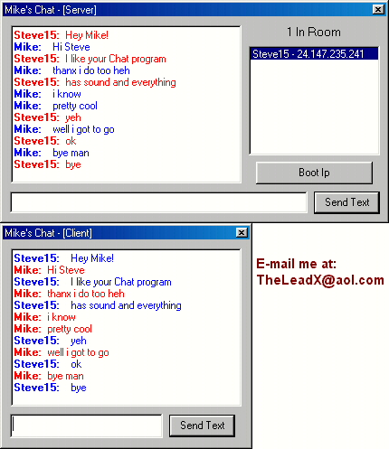



## Mike's Chat v1\.0

### Description

This is a basic Server/Client Chat made using Winsock and the UDB Protocal. The chat is in Rich Text so it looks just like an AOL chat and it also has Sounds when chatting. If the Client/Server closes the program, the other side gets an error saying so. This is so you don't talk to your self..heh All the client's Nicknames get logged into a ListBox and if they leave the room, their name gets removed from the chat listbox. I also included a "Boot Ip" for the server so he/she can boot someone in the chat that is acting up. Check this example out and RATE it! :P  Contact me at AIM: Mike3dd
 
### More Info
 

             |
---                |---
**Submitted On**   |2000-04-15 04:58:32
**By**             |[Michael L\. Canejo](https://github.com/Planet-Source-Code/PSCIndex/blob/master/ByAuthor/michael-l-canejo.md)
**Level**          |Intermediate
**User Rating**    |4.8 (72 globes from 15 users)
**Compatibility**  |VB 5\.0, VB 6\.0
**Category**       |[Internet/ HTML](https://github.com/Planet-Source-Code/PSCIndex/blob/master/ByCategory/internet-html__1-34.md)
**World**          |[Visual Basic](https://github.com/Planet-Source-Code/PSCIndex/blob/master/ByWorld/visual-basic.md)
**Archive File**   |[CODE\_UPLOAD48514162000\.zip](https://github.com/Planet-Source-Code/michael-l-canejo-mike-s-chat-v1-0__1-7313/archive/master.zip)

